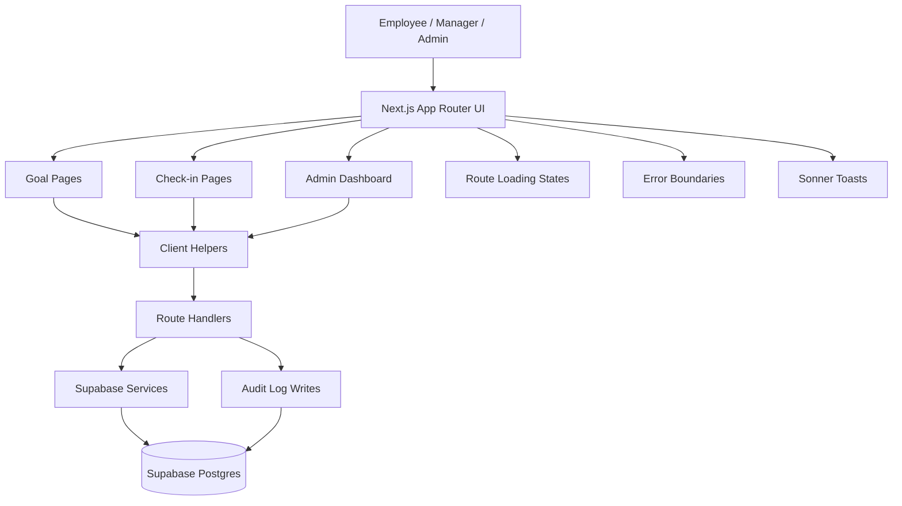

# Goal Setting & Tracking Portal Architecture

## Key Flows

- Employee creates a goal in the goal creation flow.
- Manager approves the goal, which locks it for further definition edits.
- Employee continues submitting achievement check-ins against the locked goal.
- Admin reviews analytics, audit logs, and can unlock goals when needed.

## Core Layers

- UI layer: pages, dashboards, tables, cards, charts, toasts, and fallbacks.
- Client service layer: small fetch helpers for lock state and CSV export.
- API layer: route handlers for persistence and audit logging.
- Data layer: Supabase tables for goals and audit logs.
